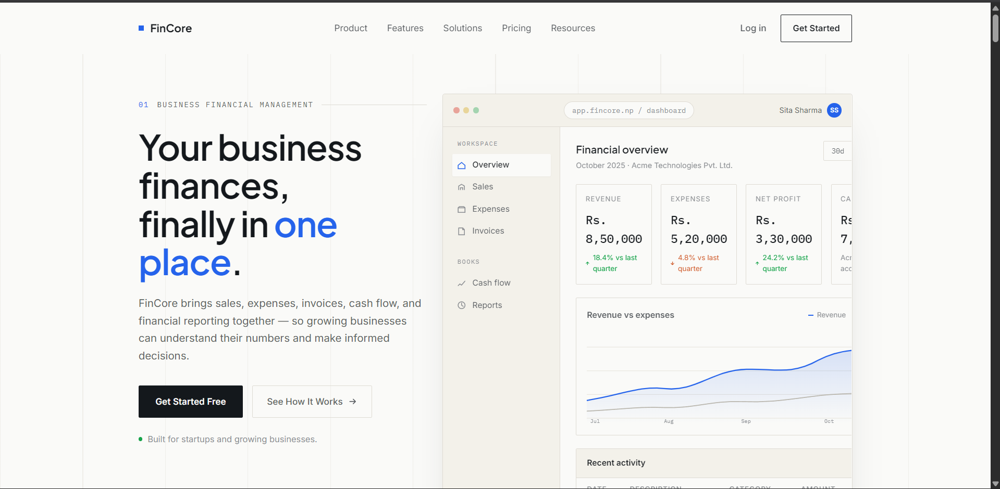

# FinCore — Financial Management & Reporting System

  

---

## 📋 Project Overview

**FinCore** is a web-based Financial Management and Reporting System designed to help companies manage their financial activities from a centralized platform. The system allows companies to manage revenue, expenses, invoices, investments, taxes, and payments, and to generate financial reports — all from a single dashboard for monitoring business performance.

---

## ❗ Problems Addressed

- Manual accounting and financial calculations
- Financial data scattered across different files and systems
- Time-consuming financial report preparation
- Difficulty tracking revenue, expenses, and investments
- Lack of real-time financial information for decision-making

## 📸 Screenshots

  

5. Open a Pull Request

---

## 📄 License

This project is licensed under the **MIT License** — see the [LICENSE](LICENSE) file for details.

---

## 👤 Author

**Your Name**
- GitHub: [@CODE-WITH-AMUL](https://github.com/CODE-WITH-AMUL)
- Email: amulshar80@gmail.com

---

  ⭐ If you find this project useful, please give it a star! ⭐

---
